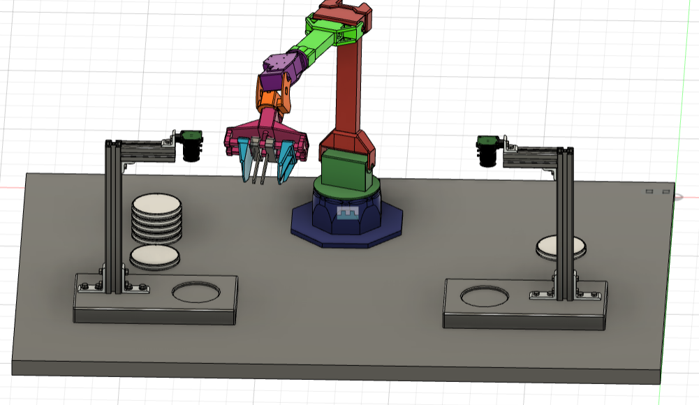
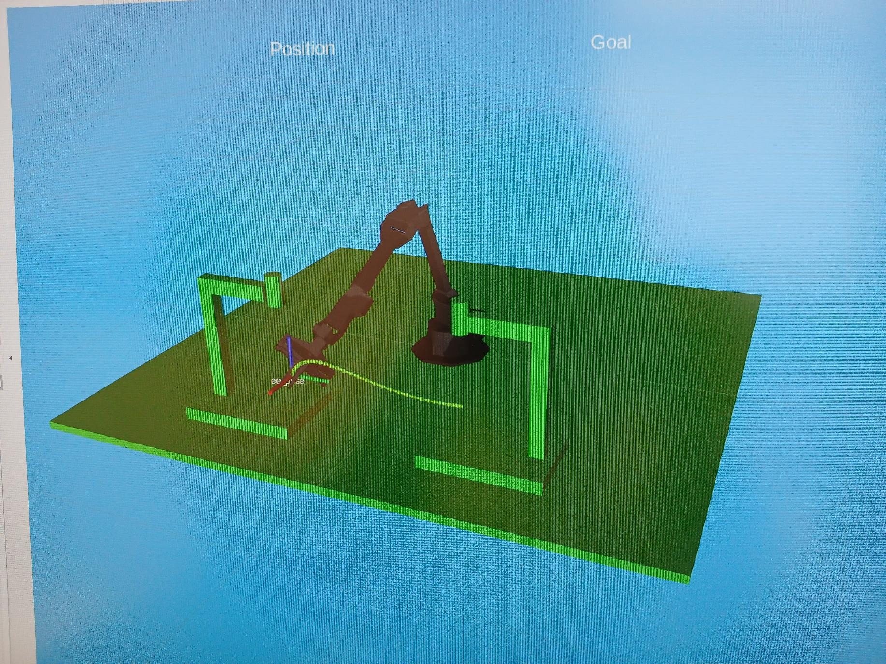
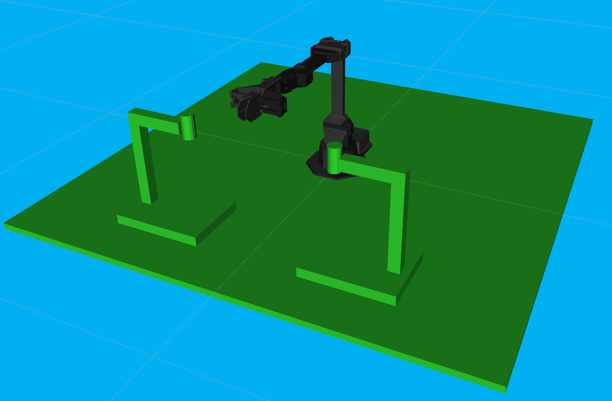
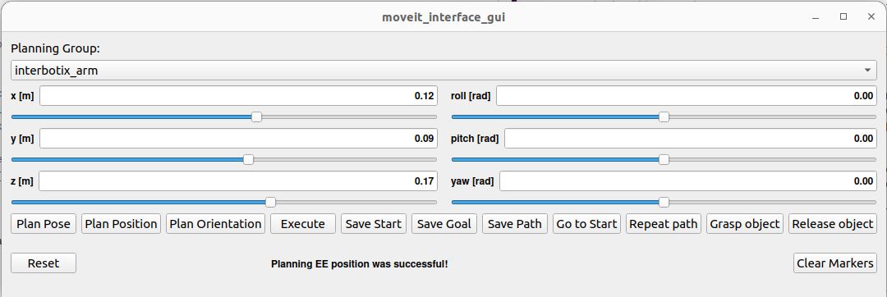

# Interbotix_arm_updated

This Repository is cloned from the Interbotix repository and modified for our use for easy manipulation 

### Check the original codebase from interbotix: https://github.com/Interbotix
### Original Documentation here: https://docs.trossenrobotics.com/interbotix_xsarms_docs/

## Overview
The Key features updated here:
- Updated GUI for control of both of manipulator arm and gripper
- Path recording, saving and retrace features added
- Saved paths can be used for the subsequent steps of movement
- Added collision objects in the environment for safe manipulation in our environment
- Cartesian planning is implemented for selected paths
- Pick and place file was added for manipulation demo

 
Below is the rough model of our final project: pick and place of object under one camera stand to another.
<!--   -->

 
   
   

Here a easily interative GUI was used to give global position (x,y,z in metres) coordinated and angles (roll,pitch and yaw in radians) for manipulator control using Moveit2. It was build on top of moveit2 package with rviz_visual_tools. This is the first step in building the perception controlled pipeline for pick and place operation using Moveit2. This updated package used moveit2 capabilities to plan path both with normal planning and cartesian planning to achieve a smooth goal of pick an object placed under the microscopic camera stand 1 and place it under camera 2. 
It can also save its path and repeat it multiple times in the subsequent steps. Objects in its environment and base are added as collision objects for smooth safe manipulation. The example code provided can be updated easily for your custom environment.

## GUI updated for full arm control
 
New features introduced: New save buttons introduce to save the start, goal and planned path for later use. Planning group change button was introduced to change the planning group to shift the controller from arm to gripper and vice versa. The Gripper planning group now takes predefined grasp and release positions from the srdf file but can be easily updated for custom positions.The buttons schronization is established to guide the user from one step to other and not to execute repeatation. Joint states are updated after every action to cover the accuracy errors in its execution. The collsiion threshold was also updated for safe manipulation

#### Updated nodes
- moveit_interface - a small C++ API that makes it easier for a user to command custom poses to the end-effector of an Interbotix arm; it uses MoveIt's planner behind the scenes to generate desired joint trajectories
- moveit_interface_gui - a GUI (modeled after the one in the joint_state_publisher package) that allows a user to enter in desired end-effector poses via text fields or sliders; it uses the moveit_interface API to plan and execute trajectories
