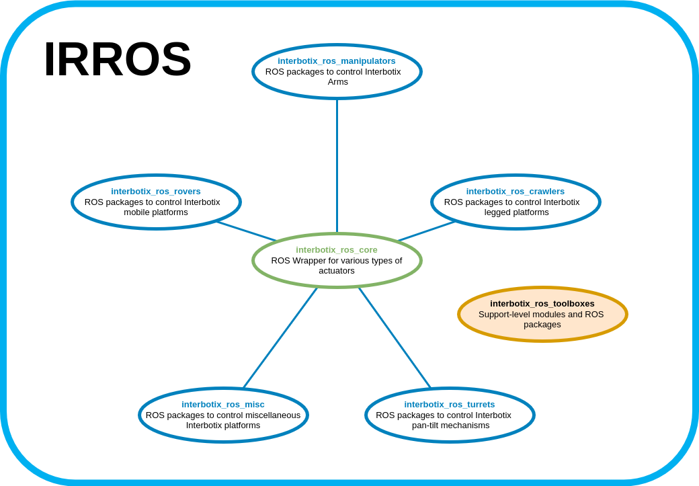

# Interbotix_ros_toolboxes

This Repository is cloned from the Interbotix toolboxes repository and modified for our use for easy manipulation

#### Check the original codebase from interbotix: https://github.com/Interbotix/interbotix_ros_toolboxes/tree/humble
#### Original Documentation here: https://docs.trossenrobotics.com/interbotix_xsarms_docs/
## Changes made

### Below is an overview and package structure as defined in the original repository for reference
## Overview


This repo contains support level ROS wrappers and robot interface modules that are used in other package for the interbotix arms.
Here this code is specifically for humble version of ROS but you want to use a different version do check out their original website.
Links to other repositories that use this repo include:
- [interbotix_ros_manipulators](https://github.com/mridulaburagohain/interbotix_arm_updated/tree/main/interbotix_ros_manipulators)

## Repo Structure
```
GitHub Landing Page: Explains repository structure and contains a single directory for each type of toolbox.
├── Toolbox Type X Landing Page: Contains support-level ROS packages for a given actuator/hardware platform.
│   ├── Support-Level Toolbox ROS Package 1
│   ├── Support-Level Toolbox ROS Package 2
│   └── Support-Level Toolbox ROS Package 3
│       ├── Robot Module Type 1
│       ├── Robot Module Type 2
│       └── Robot Module Type X
├── Support-Level Required Third Party Packages
│   ├── Third Party Package 1
│   ├── Third Party Package 2
│   └── Third Party Package X
├── LICENSE
└── README.md
```
As shown above, there are four main levels and two types of packages in this repository. To clarify some of the terms above, refer to the descriptions below.

- **Toolbox Type** - Toolboxes are broken up into types based on hardware or application. For example, one toolbox exists for Dynamixel-based robot platforms. Similarly, another toolbox exists for the Raspberry Pi platform. The Common toolbox on the other hand can be used for any application, regardless of hardware type. Future toolboxes could be based on other types of actuators or other computer platforms (like the Nvidia Jetson).

- **Support-Level Toolbox ROS Package** - This refers to a ROS package that is used for more than one Robot Type (like for manipulators and rovers). By putting the package here, there's only instance of the code instead of duplicates in multiple repositories. Some examples include the *interbotix_xs_ros_control* and *interbotix_moveit_interface* ROS packages as they are used both in the *interbotix_ros_manipulators* and *interbotix_ros_rovers* repositories.

- **Robot Module** - This refers to an interface module found in the *interbotix_XXXXX_modules* ROS package that builds on top of ROS using a more novice-friendly language like Python or MATLAB. Instead of writing a script using the various ROS libraries, one can simply import a module in whatever language they feel comfortable with and begin writing high-level programs. These modules are here because they can also be used for more than one robot type. For example, the *arm.py* module in the *interbotix_xs_modules* ROS package can be used both in X-Series LoCoBots found in the *interbotix_ros_rovers* repository and in the X-Series Arms found in the *interbotix_ros_manipulators* repository.

- **Support-Level Required Third Party Packages** - These packages are made by external organizations that the Support-Level Toolbox Packages require to run. Only packages that are not available on package indices like PyPI are stored here to reduce the git repository size. These packages will be managed using the git submodule feature. For example, the ModernRobotics Python library is available on PyPI, but the MATLAB library is not and is included here.


